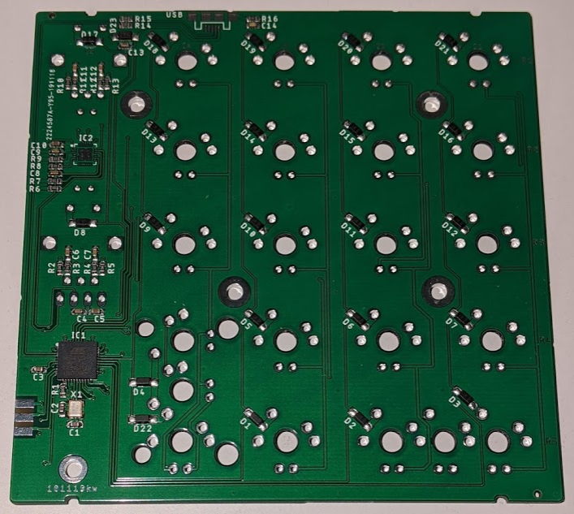
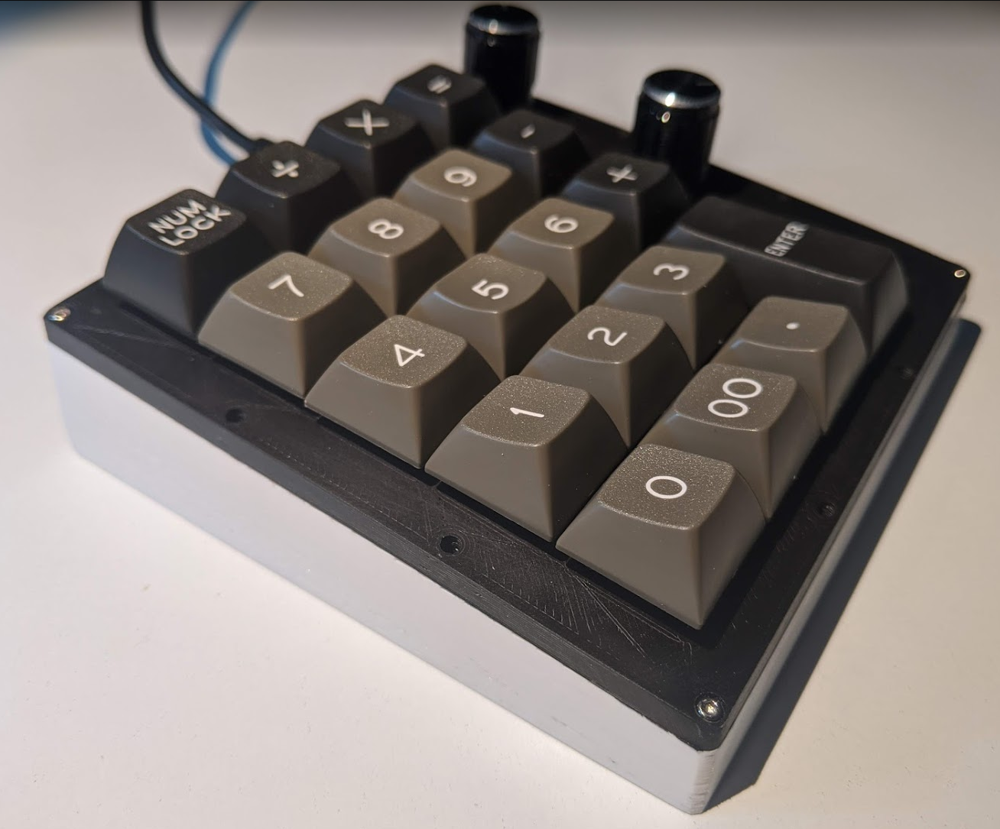

# NumPad

A custom built 5x4 key numpad with encoders and display.

## Circuit Board



The circuit board is designed in Eagle.
For easy manufacturing, the gerber-files and SMT production files are included.

The BOM and SMT placement file (CPL) are formatted for use with JLCPCB.

Apart from the keys, encoders, display, the USB-connector and the LED matrix driver all parts can be populated by JLCPCB.
The schematic contains the LCSC partnumbers in the attributes of each part.

### Keys

All keys compatible with Cherry MX 2 or 3 pin should fit the board.
You can either use a wide 0-key or a normal 0-key and a 00-key.
The Enter-key can also be replaced by two individual keys.

Unfortunately, I forgot to include the option for a standard tall plus-key. Here you have to use two keys.

### Encoders

The encoders a standard rotary encoders, just search ebay/aliexpress/amazon or your local electronics dealer.

### Display

The display is an 128x64 SPI OLED module. This can also be found on ebay/etc.

## QMK Configuration

The folder qmk_config contains the configuration and code to build QMK for the NumPad.
Just put this folder in qmk/keyboards and run

```
make numpad/v1:default
```	
	
## Case



The case can be 3D printed in two parts.
There are holes for heat-set M3 threaded inserts to hold the PCB and M2 threaded inserts to hold the plate.